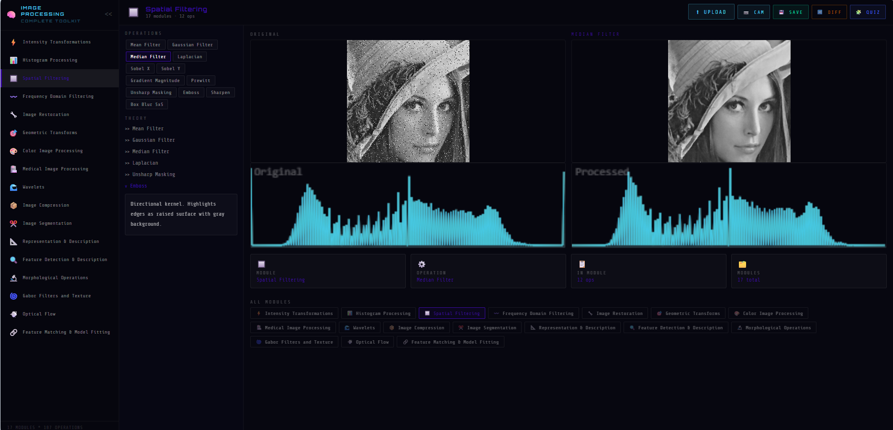

# Summary

DIPT-Web is an open-source, browser-based interactive platform for learning and exploring digital image processing (DIP). It implements 17 processing modules and 187 individual operations entirely in client-side JavaScript using the HTML5 Canvas API, with no external image processing library. The platform covers the full curriculum of a standard one-semester DIP course — from basic intensity transformations and histogram processing, through spatial and frequency domain filtering, image restoration, geometric transforms, color processing, medical imaging, wavelet decomposition, compression, segmentation, morphological operations, feature detection, Gabor texture analysis, and optical flow estimation. A real-time Sobel edge detection mode uses the WebRTC `getUserMedia()` API [@w3c_webrtc] to process live webcam frames at approximately 30 frames per second directly in the browser. The platform is deployed as a zero-installation web application at <https://image-processing-lab.vercel.app> and the source code is publicly available on GitHub (<https://github.com/Alaa-hub964/Image-processing-lab>) under the MIT licence [@ipt_web_github]. DIPT-Web is fully mobile-responsive, with a dedicated bottom navigation interface validated on Android 13 and iOS 16, making it accessible on smartphones without any modification.

# Statement of Need

Digital image processing is a foundational course in computer science and electrical engineering programmes worldwide. Laboratory exercises typically require MATLAB [@gonzalez2018] or Python with OpenCV [@bradski2008], both of which impose significant installation and configuration barriers. Students must manage software licences, package managers, interpreter versions, and dependency conflicts before writing a single line of processing code. In resource-constrained settings — older laptops, shared computers, or environments with limited internet access — these barriers frequently prevent students from completing exercises outside formal lab sessions.

Browser-based tools eliminate the installation problem entirely. However, existing browser-based image processing tools either restrict operations to artistic filters, delegate computation to server-side Python, or wrap compiled C++ code through WebAssembly (such as OpenCV.js, which exceeds 8 MB in bundle size and hides algorithm implementations behind a compiled binary). No publicly available platform implements the complete canonical DIP curriculum entirely in transparent, readable client-side JavaScript without server-side computation or external libraries. DIPT-Web addresses this gap. Every algorithm — from histogram equalization and CLAHE [@zuiderveld1994] to Harris corner detection [@harris1988], Otsu thresholding [@otsu1979], Gabor filtering [@daugman1985; @jain1991], Canny edge detection [@canny1986], Horn-Schunck optical flow [@horn1981], wavelet decomposition [@mallat1989], and Lucas-Kanade optical flow [@lucas1981] — is implemented in 10 to 30 lines of readable JavaScript, making the source code itself an educational reference that students can read, modify, and learn from directly.

# State of the Field

The main alternatives to DIPT-Web for DIP education are:

**MATLAB Image Processing Toolbox** — powerful and widely taught, but requires a commercial licence and local installation. Algorithm implementations are not visible to students.

**Python with scikit-image / OpenCV** [@van2014; @bradski2008] — free and open source, but requires a local Python environment. Installation failures are common in introductory courses. Algorithms are implemented in compiled C extensions, not readable by students without deep library knowledge.

**OpenCV.js** — a WebAssembly port of OpenCV that runs in the browser. Bundle size exceeds 8 MB, load time is slow on modest connections, and algorithm implementations are compiled binaries invisible to students.

**Marvin** [@bigolin2010] — a Java-based open-source image processing framework with a browser component. Limited to basic operations, last updated over a decade ago, and requires Java.

DIPT-Web differs from all of these in two specific ways: (1) every algorithm is implemented in plain readable JavaScript that students can inspect in browser developer tools without any library abstraction; and (2) the platform requires absolutely no installation, configuration, or account — it opens instantly in any modern browser. The live webcam Sobel mode is not available in any of the above alternatives without significant additional setup.

# Software Design

Several deliberate design decisions shaped the architecture of DIPT-Web.

**No external image processing library.** The HTML5 `ImageData` interface provides a `Uint8ClampedArray` pixel buffer in row-major RGBA order. This is sufficient to implement any pixel-level operation. Avoiding libraries keeps the bundle small (~180 KB gzipped), keeps every algorithm transparent and inspectable, and means the platform will continue working as long as the Canvas API is supported — which is guaranteed by the W3C specification [@w3c_canvas].

**Single pure processing function.** All 187 operations are dispatched through one function, `processImg(src, modId, topic, params)`, which takes an `ImageData` and returns a new `ImageData` without mutating its input. This makes the data flow simple to follow and easy to extend.

**Float32Array for intermediate results.** Canvas pixels are stored as `Uint8ClampedArray` (integers 0–255). Convolution outputs can be negative (edge detectors) or exceed 255 (sharpening kernels). Storing intermediate results in `Float32Array` avoids premature clamping and allows correct normalization before display.

**Loop-based array extrema.** JavaScript's `Math.min(...array)` spread syntax fails with a stack overflow on arrays larger than approximately 65,000 elements. For a 320×320 image (102,400 pixels), this is a real problem. All array minimum and maximum computations use explicit `for` loops instead.

**requestAnimationFrame render loop for live webcam.** The live Sobel pipeline draws each decoded video frame to an offscreen canvas via `drawImage()`, extracts the pixel buffer via `getImageData()`, computes gradient magnitude using inline 3×3 Sobel kernels, and writes the result to a visible canvas via `putImageData()`. Using `requestAnimationFrame` synchronizes processing with the display refresh cycle and avoids dropped frames.

**Declarative module system.** Each of the 17 modules is defined as a plain JavaScript object with a unique ID, display label, colour accent, list of operation topics, and a theory dictionary mapping each topic name to its mathematical description. This separates content from rendering completely — adding a new module requires only adding one object to the `MODULES` array.

**Mobile-responsive layout.** On screens narrower than 768px, the desktop sidebar and parameter panel are replaced by a four-tab bottom navigation bar (Modules / Operations / Canvas / Theory) implemented entirely in CSS media queries with no additional JavaScript framework. Touch targets for operation chips and slider thumbs are enlarged for comfortable thumb interaction. This design was validated on Android 13 (Chrome Mobile) and iOS 16 (Safari Mobile), confirming that all 187 operations are accessible from a smartphone without any desktop-specific interaction.

# Research Impact Statement

DIPT-Web covers all 17 chapter topics of Gonzalez and Woods [@gonzalez2018], the most widely adopted DIP textbook, making it directly usable as a companion laboratory tool for any standard DIP course without modification. The platform has been tested and confirmed to work without configuration on Windows 10/11, macOS 13, Ubuntu 22.04, Android 13, and iOS 16. The mobile-responsive layout extends accessibility further — students can use the platform on a smartphone during lectures without requiring a laptop, which is particularly relevant in resource-constrained settings. The live Sobel webcam mode provides a real-time demonstration capability not available in MATLAB or Python notebook environments without additional hardware configuration. The MIT licence and zero-dependency architecture make the codebase directly reusable by developers who need browser-based implementations of specific algorithms such as CLAHE, Harris corner detection, or Lucas-Kanade optical flow in their own projects.

**Limitations and future work.** The current implementation performs all computation on the CPU using JavaScript typed arrays. Computationally intensive operations such as CLAHE and full Gabor filter banks are noticeably slow at larger image sizes. Future work will address three directions: (1) GPU acceleration of heavy operations using WebGL fragment shaders; (2) addition of deep learning inference modules via TensorFlow.js to bridge classical and modern image processing; and (3) a formal controlled user study comparing learning outcomes between students using DIPT-Web and those using MATLAB-based laboratory environments.

# AI Usage Disclosure

Claude (Anthropic, claude-sonnet-4-6) was used to assist with portions of the JavaScript source code generation, code debugging, and drafting sections of this paper. All AI-assisted code was reviewed, tested, and validated by the authors. All AI-assisted paper text was reviewed, edited, and rewritten by the authors. The core architectural decisions — module structure, Canvas API pipeline, no-library approach, live webcam design — were made by the authors. The authors take full responsibility for the accuracy, originality, and content of all submitted materials.

# Acknowledgements

The authors thank Lovely Professional University for providing the academic environment that supported this work. The Vercel platform is acknowledged for providing free hosting for the deployed application.

# References
